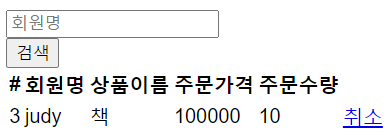

# Spring_exercise2
<em>놀랍게도 exercise1의 심화 버전이 된 활용 강의의 실습...</em>
<br>
<h3><em>역할과 구현은 일단 두자....</em></h3>

이번에는 상품을 수정하고, 주문을 취소하는
회원 - 상품 - 주문 간의 연결에 집중!

<h1><em>메인화면</em></h1>


<br>
<ul>
  <li> 회원 기능 </li>
   -> 등록 / 조회
  <li> 상품 기능 </li>
   -> 등록 / 수정 / 조회
  <li> 주문 기능 </li>
   -> 주문 / 조회 / 취소
</ul>

<br> <br>



<br>

※ 다만 문제는 저 취소 버튼을 누르면 원래 h2에서 자동으로
재고에 취소된 물품 개수만큼 추가되어야 하는데 실패...

<br>
** 요구사항
<ul>
  <li> 재고 관리 필수 </li>
  <li> 상품 종류는 3개(도서, 음반, 영화) </li>
</ul>

<em>
주문 상태, 상품 종류, 배달 등등
</em>
<br>

고려할 것들이 더 많았지만 일단은 
테이블과 컬럼 및 서버 등록이 목적이므로
<br>

내가 감당할 수 있는 수준으로만 하기로 했다ㅠㅠㅠ

<br>

<h3><em> 개발 구상도 </em></h3>


<br>
<br>
아직 나는 검색 기능을 개발하는데 어려움을 느껴
강의를 듣고 해야할 것 같다
<br>
추후에 jpa 책을 듣고 query를 잘 사용하게 되면 정리하도록!

```yml
spring:
  datasource:
    url: jdbc:h2:tcp://localhost/~/test
    username: sa
    password:
    driver-class-name: org.h2.Driver

```
이런 식으로 h2 서버와의 연결을 돕는 yml 파일을 생성한다

<br>

또한 서버에 들어갈 table과 column을 설정하기 위해 

```java
    @Id
    @GeneratedValue
    @Column(name="member_id")
    private Long id;

    @Column(name="member_city")
    private String city;

    @OneToMany(mappedBy = "member")
    private List<Order> orders = new ArrayList<>();


```
이렇게 애노테이션으로 표시를 해준다!
<br>
이때 이 변수들을 포함하는 클래스에는 @Entity 애노테이션 표시를
꼭꼭꼭!! 쓴다

<h3><em> 개발순서 </em></h3>
1. 일단 중심 도메인들을 생성!
<br> ex. Order, Product, Member, OrderItem, ...
2. 이들을 저장하고 관리할 수 있는 리포지토리, 
    리포지토리를 불러와 기능을 편리하게 제공하는 서비스 클래스를 만든다
3. 상품 취소 시 재고가 증가, 주문 취소시 재고가 증가하는 함수를 추가한다
4. controller 디렉토리를 만들어 html과 연동시켜 페이지를 정상 작동 시킨다

```java
import org.springframework.web.bind.annotation.ModelAttribute;
import org.springframework.web.bind.annotation.PathVariable;
import org.springframework.web.bind.annotation.RequestParam;

@GetMapping,@PostMapping
@PathVariable,@RequestParam,@ModelAttribute
```


