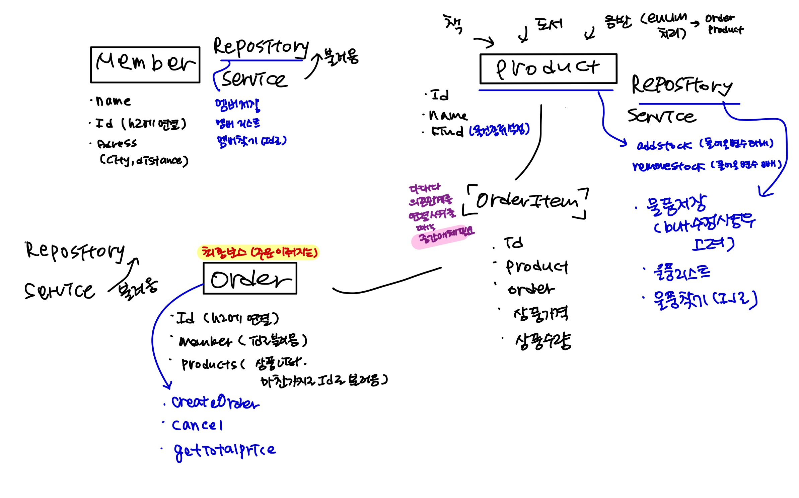

# Spring_exercise2
<em>놀랍게도 exercise1의 심화 버전이 된 활용 강의의 실습...</em>
 
<h3><em>역할과 구현은 일단 두자....</em></h3>

 
<ul>
  <li> 회원 기능 </li>
   -> 등록 / 조회
  <li> 상품 기능 </li>
   -> 등록 / 수정 / 조회
  <li> 주문 기능 </li>
   -> 주문 / 조회 / 취소
</ul>

 
** 요구사항
<ul>
  <li> 재고 관리 필수 </li>
  <li> 상품 종류는 3개(도서, 음반, 영화) </li>
</ul>

<em>
주문 상태, 상품 종류, 배달 등등
</em>
 
고려할 것들이 더 많았지만 일단은 
테이블과 컬럼 및 서버 등록이 목적이므로
 
내가 감당할 수 있는 수준으로만 하기로 했다ㅠㅠㅠ

